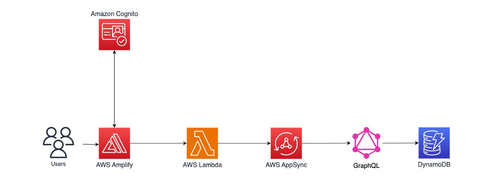

# Basic-web-application
Hosting a React web application on AWS using Amplify to add authentication, data, and a serverless function to capture the signed-up user's email and save it in the database using Terraform to manage the infrastructure.

## Overview
In this project we will:
 - Host: Build and deploy a React application on the AWS global content delivery network (CDN).
 - Authenticate: Add authentication to your app to enable sign-in and sign-out functionality.
 - Database: Integrate a real-time API, database, and a serverless function.
 - Function: Implement a lambda function that is triggered when a user signs up to the App.

## Application architecture
The following diagram provides a visual representation of the services used in this project and how they are connected. This application uses AWS Amplify, GraphQL API, AWS Lambda, and Amazon DynamoDB.

# Create a Web App
## Overview
AWS Amplify offers a Git-based CI/CD workflow for building, deploying, and hosting single-page web applications or static sites with backends. When connected to a Git repository, Amplify determines the build settings for both the frontend framework and any configured backend resources, and automatically deploys updates with every code commit.

## Key concepts
- React Application: React is a JavaScript library that enables developers to quickly build performant single-page applications.
- Git: Git is a version control system that allows developers to store files, maintain and update relationships between files and directories, and track versions and changes to the files